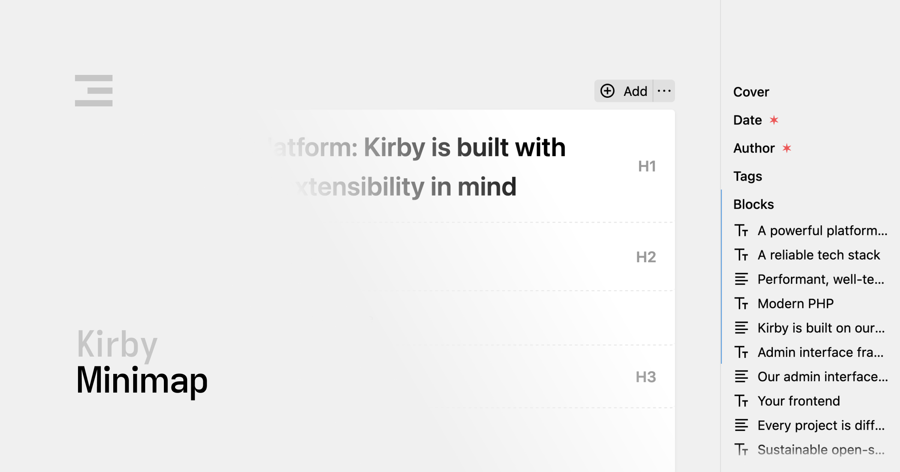

[](https://kirby.tools/minimap)

# Kirby Minimap

Kirby Minimap is a free plugin for [Kirby CMS](https://getkirby.com). Install it, and a structured sidebar appears next to the site view and every page view – no license activation, no setup. It lists the fields and blocks of the current Panel tab, marks the ones in view as you scroll, and scrolls to the one you click. Made for long blueprints.

## Features

- 🖱️ **Jump to a Field or Block**: Click an entry and the Panel scrolls it into the middle of the view, with a short pulse on blocks.
- 🎬 **Blocks by Icon and First Words**: Blocks fields unfold into their blocks, each with the fieldset's icon and the first 50 characters of text.
- 🫴 **See Where You Are**: Fields and blocks in view are marked in the sidebar as you scroll, and required fields carry a star. The sidebar collapses to a strip of dashes and remembers its state.

## Demo

For a quick demo of the minimap in action, check out the following screencast:

https://github.com/user-attachments/assets/40e4e439-a79a-49b4-9c55-d6ab8fba8373

## Requirements

- Kirby 4 or Kirby 5

## Installation

### Composer (Recommended)

```bash
composer require johannschopplich/kirby-minimap
```

### Manual Installation

Download and copy this repository to `/site/plugins/kirby-minimap`.

## Documentation

For detailed usage instructions, visit the [Kirby Minimap documentation](https://kirby.tools/docs/minimap).

## License

[MIT](./LICENSE) License © 2025-PRESENT [Johann Schopplich](https://github.com/johannschopplich)
